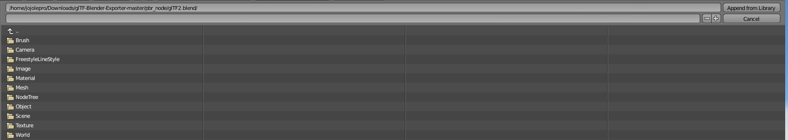
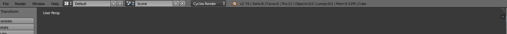
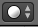
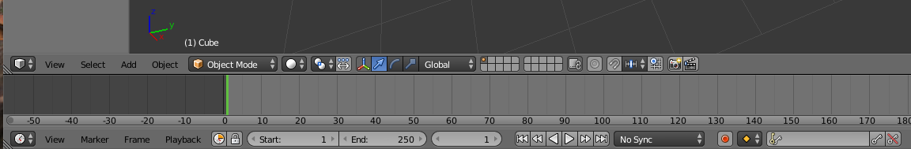

# Creating Maps

Creating maps is not an easy task if you have never used a 3d modelling software before. 
Luckily for us, most maps are composed of simple shapes, so making maps is a good way to start learning.

## Installing the tools

### Modelling Software

First of all, you will need a glTF compatible modelling software.
Here, I will be showing how to do it using Blender.

It is a free and well known software, so finding documentation if you need it should be pretty easy.

You can download Blender [here](https://www.blender.org/download/).
This version is written with the version 2.79 in mind.
This is the version the glTF exporter is currently compatible with at the time of writing.

### glTF Exporter

HoppinWorld loads map in a file format called glTF.
The file extensions for that format can either be:
* .gltf and .bin
* .glb

HoppinWorld uses only .glb files when exporting, as that makes for less files to move around.
Keep that in mind when we get to the exporting step at the end of this chapter.

Now, let's install the glTF exporter!
Detailled installation instructions can be found here: [Install](https://github.com/KhronosGroup/glTF-Blender-Exporter/tree/master/scripts).

## Creating our first map!

### Opening Blender

Open Blender.
You should have an icon on your desktop.
If not, press the windows key and type blender.

You should now be greated by a pretty image and a scene with a single cube.
You can click on the image to make it go away.

### Importing the Material Nodes

The first thing we are going to do is import the glTF materials that we need in order to add color to our objects.
In the top left corner, click File->Append.
Then, navigate in your download folder and into the folder you downloaded earlier to install the exporter.
In this folder, you should see a folder called pbr_node. Go into it and select the glTF2.blend file.

You should now be seeing those folders:

Go into the the NodeTree folder.
While holding the SHIFT key, click both on the glTF Metallic Roughness and glTF Specular Glossiness items.
Finally, click the Append from library button at the top right.

Ooof, that was a lot of work! The good news is that we are now done with the hardest step!

At the top of the screen, change Blender Render to Cycles Render.

At the bottom of the screen, change the rendering mode from solid to "material".
This is the icon you are looking for:

Here's a bigger screenshot to help you find it:

Allright! Now the fun begins: Its time to actually create the map!

### Placing Items

